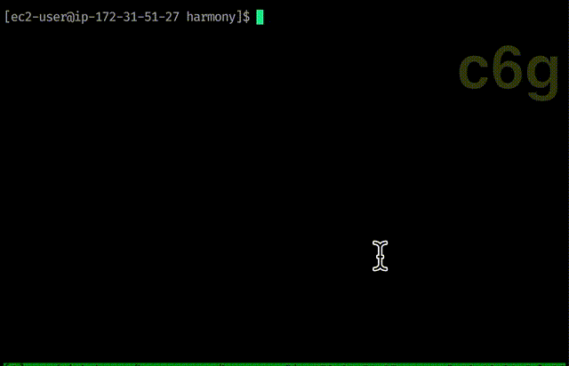

# harmony-arm
Harmony On ARM64. It was tested on c6g instance on AWS.

## Quickstart
* launch m6g/c6g instance; ssh into the instance
* install build tools
```bash
sudo yum install glibc-static gmp-devel gmp-static openssl-libs openssl-static gcc-c++
```
* download harmony git repos
```bash
mkdir -p $(go env GOPATH)/src/github.com/harmony-one
cd $(go env GOPATH)/src/github.com/harmony-one

git clone https://github.com/harmony-one/mcl.git
git clone https://github.com/harmony-one/bls.git
git clone https://github.com/harmony-one/harmony.git

cd harmony
make linux_static
```

## Screenshot



## Links
[Medium Post](https://medium.com/@leo_hao/harmony-on-arm64-d4508de9929f)
